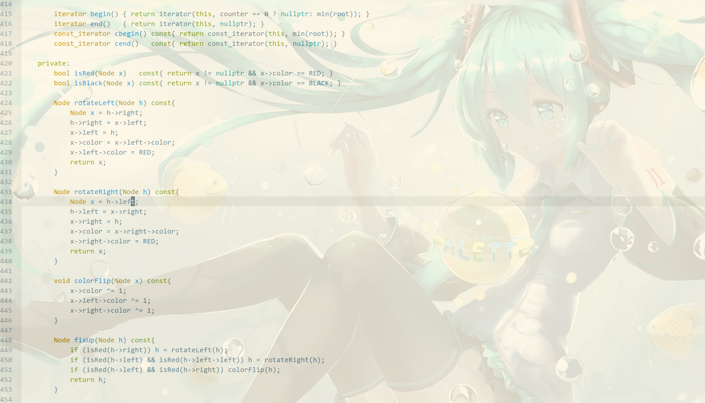

# Emacs config

## 简介

我的`emacs`配置备份



## 功能

1. 隐藏多余的控件

   ```lisp
   (menu-bar-mode 0)
   (tool-bar-mode 0)
   (scroll-bar-mode 0)
   ```

   

2. 解决编码问题

   ```lisp
   (prefer-coding-system 'cp950)
   (prefer-coding-system 'gb2312)
   (prefer-coding-system 'cp936)
   (prefer-coding-system 'gb18030)
   (prefer-coding-system 'utf-16)
   (prefer-coding-system 'utf-8-dos)
   (prefer-coding-system 'utf-8-unix)
   ```

3. solarized light 主题

4. 设置背景透明

   ```lisp
   (setq alpha-list '((85 55) (100 100)))    
   (defun loop-alpha ()  
     (interactive)  
     (let ((h (car alpha-list)))                  
       ((lambda (a ab)  
          (set-frame-parameter (selected-frame) 'alpha (list a ab))  
          (add-to-list 'default-frame-alist (cons 'alpha (list a ab)))  
          ) (car h) (car (cdr h)))  
       (setq alpha-list (cdr (append alpha-list (list h))))  
       )  
   )
   ```

5. d跳转窗口快捷键

   ```lisp
   (global-set-key [M-left] 'windmove-left)
   (global-set-key [M-right] 'windmove-right)
   (global-set-key [M-up] 'windmove-up)
   (global-set-key [M-down] 'windmove-down)
   ```

   

6. 鼠标滚轮放大缩小

   ```lisp
   (global-set-key (kbd "<C-mouse-4>") 'text-scale-increase)
   (global-set-key (kbd "<C-mouse-5>") 'text-scale-decrease)
   ```

   

7. 设置了一些语言的简单扩展
	- [x] c++
	- [x] java
	- [x] asm
	- [x] python
	- [x] php
	- [ ] haskell
